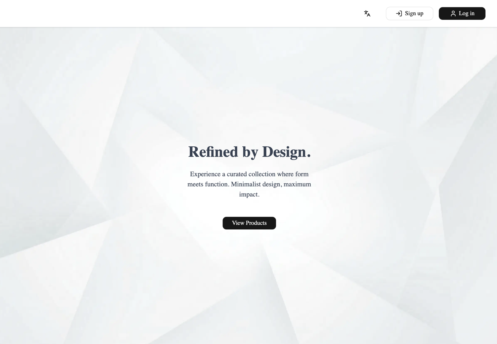
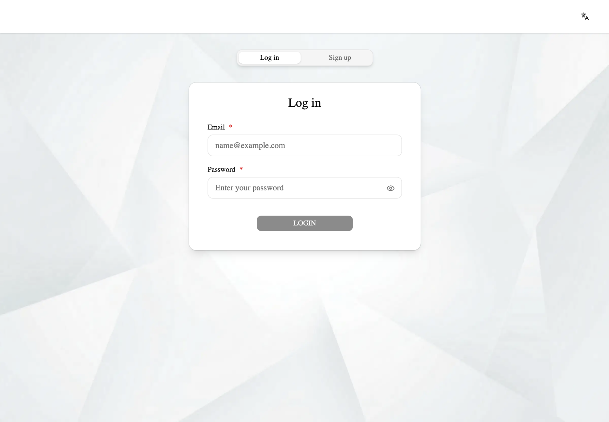
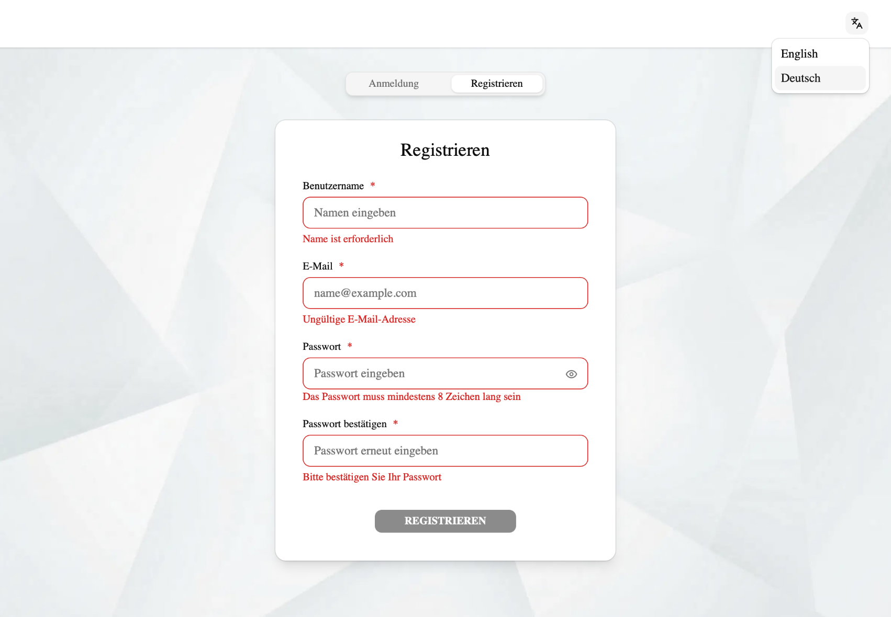
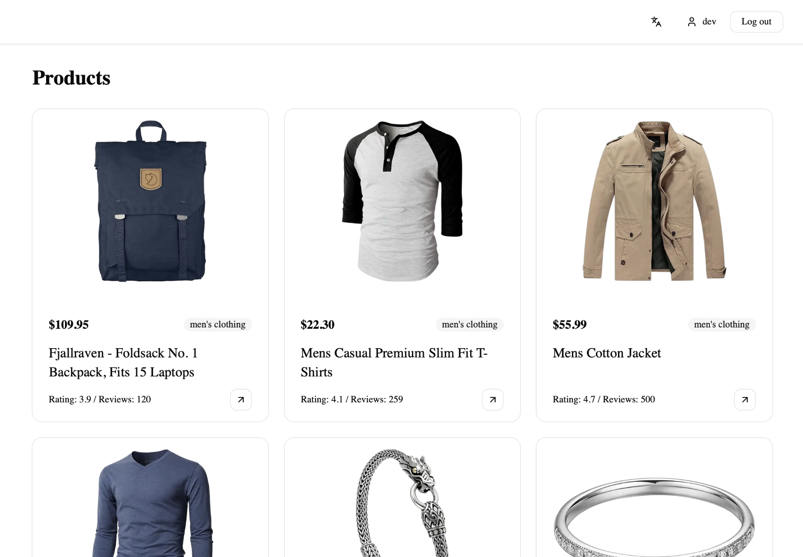
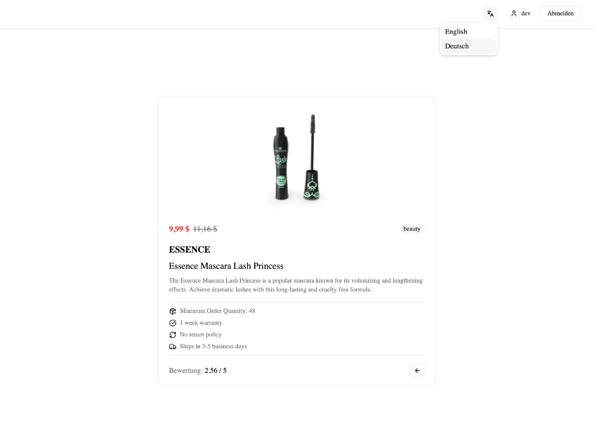

# Refined Store

A minimalist e-commerce product catalog built with Next.js 15. Browse a curated collection of products, view detailed product pages, and manage your account with a fully client-side authentication flow.

---

## Pages

- `/` — Home page with hero section
- `/auth` — Login / Sign up (tab switcher)
- `/products` — Product catalog grid (authenticated only)
- `/products/[id]` — Single product detail page (authenticated only)

---

## Tech Stack


| Category         | Technology                                                                         |
| ---------------- | ---------------------------------------------------------------------------------- |
| Framework        | [Next.js 15](https://nextjs.org/) (App Router)                                     |
| Language         | [TypeScript](https://www.typescriptlang.org/)                                      |
| Styling          | [Tailwind CSS v4](https://tailwindcss.com/)                                        |
| UI Components    | [shadcn/ui](https://ui.shadcn.com/) + [Radix UI](https://www.radix-ui.com/)        |
| Icons            | [Lucide React](https://lucide.dev/)                                                |
| State Management | [Zustand](https://zustand-demo.pmnd.rs/) (with localStorage persistence)           |
| Server State     | [TanStack Query v5](https://tanstack.com/query)                                    |
| Forms            | [React Hook Form](https://react-hook-form.com/) + [Zod](https://zod.dev/)          |
| i18n             | [next-intl](https://next-intl.dev/) (English / German)                             |
| Auth             | Client-side with [bcryptjs](https://github.com/dcodeIO/bcrypt.js) password hashing |
| E2E Testing      | [Playwright](https://playwright.dev/)                                              |
| Linting          | [ESLint](https://eslint.org/) + [Prettier](https://prettier.io/)                   |
| API              | [Dummy JSON API](https://dummyjson.com/docs/products)                                        |


---

## Getting Started

### Prerequisites

- Node.js 18+
- npm

### Installation

```bash
# Clone the repository
git clone https://github.com/e1em9nt/next-app.git
cd project

# Install dependencies
npm install
```

### Running the development server

```bash
npm run dev
```

Open [http://localhost:3000](http://localhost:3000) in your browser. The app redirects to `/en` by default.

### Building for production

```bash
npm run build
npm run start
```

### Running E2E tests

```bash
# Make sure the dev server is running first
npm run dev

# In a separate terminal
npx playwright test
```

---

## Authentication

Authentication is fully client-side using Zustand with localStorage persistence. Passwords are hashed with bcryptjs before storage.

- Register with name, email and password
- Login with registered credentials
- Product pages are protected — unauthenticated users are redirected to `/auth`
- Authenticated users visiting `/auth` are redirected to `/products`

---

## Internationalization

The app supports two languages:

- **English** — `/en`
- **German** — `/de`

Language can be switched via the globe icon in the header.

---

## Deployed Site

[Live Demo](https://refined-store.vercel.app)

---

## Screenshots

| Welcome Page | Log In |
|---|---|
|  |  |

| Sign Up | Products |
|---|---|
|  |  |

| Product Detail | 404 Page |
|---|---|
|  |  |
